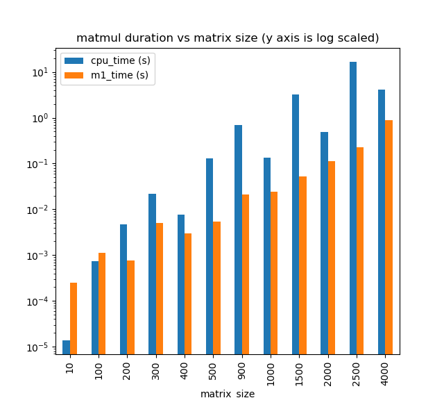
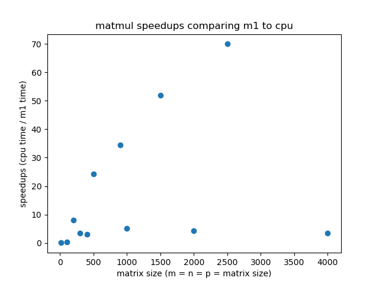

# MetalNeedle: M1 backend for an education deep learning framework Needle

Final project for the class "Deep Learning Systems Algorithms and Implementation" from CMU, where we try to make needle work with Apple M1 chips.

## Prerequisites

To run the code in this repo (with M1 as NDArray backend), we assume you have a Mac machine with M1 chip on it. There are some setup steps you need to follow before you can run our code, as indicated below.

### Step 1. Install necessary compilation tools

First, you need to download XCode and its SDK. You can install Xcode through your Mac’s app store.
To ensure Metal is installed successfully, run this in command line:
`xcrun metal`

if you run into the following error:

> `xcrun: error: unable to find utility "metal", not a developer tool or in PATH`

run the following command to fix it:

```bash
xcode-select --switch /Applications/Xcode.app/Contents/Developer
```

Then, run the following in the Mac terminal (you can skip these if you already have these installed on your system):

```bash
brew install llvm
brew install cmake
```

### Step 2. Install python dependencies

We recommend using conda for installing all the python packages needed for running unit tests in this codebase. After installing conda on your system, run the following to install the conda environment needed for our code.

``` bash
conda env create --file environment.yaml
```

Run the following to activate the environment

``` bash
conda activate dlsys-needle-m1
```

If you want, you can also use pip to install all the packages listed in `environment.yml` and not use conda.

### Step 3. Download data

Some of the unit tests require CIFAR and PTB data. You can download them by running

``` bash
python3 download_data.py
```

**NOTE: you should run `download_data.py` under the project root directory, because `download_data.py` hardcodes the data path.**

## Setup

The project mainly consists two parts: the automatic differentiation framework ***needle*** (under `./needle`, written in Python) and different ndarray backends (under `ndarray_backend`, written in C++, supports CPU, GPU and M1). 

First compile the backend code:

``` bash
make
```

Then install the `needle` package in editable mode:

``` bach
pip3 install -e .
```

## Usage

### Run unit tests, now with M1 as backend

We combined all local tests from [hw3](https://github.com/dlsyscourse/hw3) and [hw4](https://github.com/dlsyscourse/hw4), and make it available for m1-backend, except for mugrade tests and language model training(it fails due to our hw4 implementation error)

According to [this PyTorch GitHub issue](https://github.com/pytorch/pytorch/issues/77799), currently sequential models are not friendly for m1 GPUs even for Apple's MPS backend and PyTorch(it takes much longer than CPU), so we reduced seq_len, input_size, hidden_states for rnn and lstm tests so that they can be passed within acceptable time.

Run unit tests on everything:

``` bash
python3 -m pytest -v
```

Run part of the tests according to test names, e.g. "m1":

``` bash
python3 -m pytest -v -k "m1"
```

### benchmark matrix multiplication on CPU vs M1

``` bash
python3 apps/benchmark_matmul.py
```

You should see the following plots that compare the matrix multiplication speed on m1 vs cpu. As we can see, for matrices with size bigger than 100, m1 consistently have ~3x speedup comparing to cpu. In some cases such as when matrix size is 2500, m1 achieves 70x speedup comparing to cpu! (this is likely due to cache misses in the CPU for loop)


